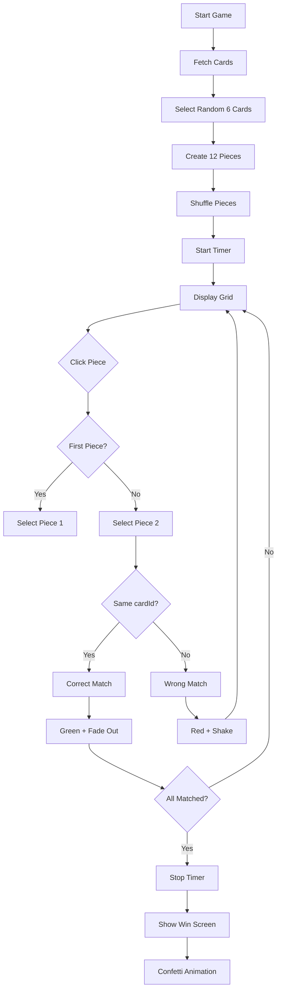

# Match Game - Ghép thẻ

## 📖 Tổng quan

Game "Match" (Ghép thẻ) giống Quizlet - một trò chơi tương tác giúp học từ vựng hiệu quả hơn.

## 🎮 Cách chơi

### Mục tiêu

Ghép các mảnh **Term** (Thuật ngữ) với **Definition** (Định nghĩa) tương ứng trong thời gian nhanh nhất.

### Luật chơi

1. Game chọn ngẫu nhiên **6 thẻ** từ deck (hoặc ít hơn nếu deck nhỏ)
2. Mỗi thẻ được tách thành **2 mảnh**:
   - 📝 Mảnh Term (Thuật ngữ)
   - 📖 Mảnh Definition (Định nghĩa)
3. Tổng cộng **12 mảnh** được xáo trộn ngẫu nhiên
4. Click chọn 2 mảnh:
   - ✅ **Đúng**: Cả 2 mảnh biến mất (500ms)
   - ❌ **Sai**: Cả 2 mảnh rung lắc màu đỏ (800ms)
5. **Thắng**: Khi ghép hết tất cả các mảnh

## 🎯 Tính năng

### 1. **Timer (Đồng hồ bấm giờ)**

- ⏱️ Tự động bắt đầu khi vào game
- 📊 Hiển thị thời gian hoàn thành khi thắng
- 🔄 Reset khi chơi lại

### 2. **Grid Layout (Lưới thẻ)**

- 📱 **Mobile**: 2 cột
- 💻 **Tablet**: 3 cột
- 🖥️ **Desktop**: 4 cột
- Responsive và đẹp mắt trên mọi thiết bị

### 3. **Rich Text Support**

- ✅ Hiển thị HTML formatting (bold, italic, colors, etc.)
- ✅ Sử dụng `dangerouslySetInnerHTML` và prose classes
- ✅ Tương tự Learn Mode

### 4. **Image Support**

- 🖼️ Hiển thị hình ảnh nếu definition có `imageUrl`
- 📐 Size: 64x64px, rounded corners
- 📍 Position: Trên text

### 5. **Animations**

- ✨ **Select**: Scale 0.95 + Blue background
- ✅ **Correct**: Green background → Fade out
- ❌ **Wrong**: Red background + Shake animation
- 🎉 **Win**: Confetti celebration

### 6. **Win Screen**

- 🏆 Trophy icon
- ⏱️ Hiển thị thời gian hoàn thành (format: MM:SS)
- 🔄 Nút "Chơi lại"
- 🏠 Nút "Về trang chủ"

## 🔧 Cấu trúc Code

### Files

```
web/
├── app/
│   └── decks/
│       └── [deckId]/
│           └── match/
│               └── page.tsx        # Main game page
└── app/
    └── globals.css                 # Shake animation
```

### State Management

```typescript
// Game pieces
const [pieces, setPieces] = useState<MatchPiece[]>([]);

// Selected pieces (max 2)
const [selectedPieces, setSelectedPieces] = useState<string[]>([]);

// Matched pieces (hidden from grid)
const [matchedPieceIds, setMatchedPieceIds] = useState<Set<string>>(new Set());

// Wrong pieces (shake animation)
const [wrongPieceIds, setWrongPieceIds] = useState<Set<string>>(new Set());

// Timer
const [timer, setTimer] = useState(0);
const [timerRunning, setTimerRunning] = useState(false);

// Complete state
const [isComplete, setIsComplete] = useState(false);
```

### Data Structure

```typescript
interface MatchPiece {
  id: string; // "term-123" or "def-123"
  cardId: number; // Card ID (for matching)
  type: "term" | "definition";
  content: string; // HTML content
  imageUrl?: string; // Optional image
}
```

## 🎨 UI Components

### MatchCard

```typescript
interface MatchCardProps {
  piece: MatchPiece;
  isSelected: boolean;
  isWrong: boolean;
  onClick: () => void;
}
```

**States:**

- Default: White background, gray border
- Selected: Blue background, blue border, scale 0.95
- Wrong: Red background, red border, shake animation
- Matched: Hidden (display: none)

### Grid CSS

```css
.grid {
  grid-cols-2      /* Mobile */
  md:grid-cols-3   /* Tablet */
  lg:grid-cols-4   /* Desktop */
  gap-3 md:gap-4
}
```

## 🎬 Animation Details

### Shake (Wrong Match)

```css
@keyframes shake {
  0%,
  100% {
    transform: translateX(0);
  }
  10%,
  30%,
  50%,
  70%,
  90% {
    transform: translateX(-4px);
  }
  20%,
  40%,
  60%,
  80% {
    transform: translateX(4px);
  }
}

.animate-shake {
  animation: shake 0.5s ease-in-out;
}
```

### Confetti (Win)

```typescript
confetti({
  particleCount: 3,
  angle: 60,
  spread: 55,
  origin: { x: 0 },
  colors: ["#3b82f6", "#8b5cf6", "#ec4899"],
});
```

## 🔄 Game Flow



## 📱 Responsive Design

| Device              | Columns | Gap  | Card Size |
| ------------------- | ------- | ---- | --------- |
| Mobile (< 768px)    | 2       | 12px | ~150px    |
| Tablet (768-1024px) | 3       | 16px | ~180px    |
| Desktop (> 1024px)  | 4       | 16px | ~200px    |

## 🎯 User Experience

### Feedback

- ✅ **Visual**: Color changes (blue/green/red)
- ✅ **Animation**: Scale, shake, fade out
- ✅ **Sound**: Toast notifications (optional)
- ✅ **Confetti**: Win celebration

### Accessibility

- ✅ Keyboard accessible (click events)
- ✅ High contrast colors
- ✅ Clear visual feedback
- ✅ Responsive text sizing

## 🚀 Performance

### Optimization

- ✅ useState for local state (no Redux overhead)
- ✅ useEffect cleanup for timer
- ✅ Minimal re-renders (Set for matched pieces)
- ✅ CSS animations (GPU accelerated)

### Loading Strategy

```typescript
// Fetch cards once on mount
useEffect(() => {
  if (deckId) {
    fetchCards();
  }
}, [deckId]);
```

## 🧪 Testing Scenarios

1. **Empty Deck**: Show error, redirect to deck page
2. **Small Deck (< 6 cards)**: Use all available cards
3. **Large Deck**: Random selection of 6 cards
4. **Quick Clicks**: Prevent selection during check
5. **Mobile View**: Test 2-column layout
6. **Win Condition**: All pieces matched correctly

## 🎓 Learning Benefits

1. **Active Recall**: Requires remembering connections
2. **Speed Practice**: Timer encourages quick thinking
3. **Visual Learning**: Images support visual learners
4. **Gamification**: Fun and engaging
5. **Immediate Feedback**: Know right/wrong instantly

## 🔮 Future Enhancements

- [ ] Difficulty levels (4/6/8 cards)
- [ ] Leaderboard (best times)
- [ ] Hints system
- [ ] Sound effects
- [ ] Multiplayer mode
- [ ] Daily challenges
- [ ] Achievement badges

## 📝 Notes

- Game requires minimum 1 card in deck
- Maximum 6 cards used per game
- Timer format: MM:SS (minutes:seconds)
- Matched pieces hidden with `display: none`
- Rich text HTML sanitized by browser
